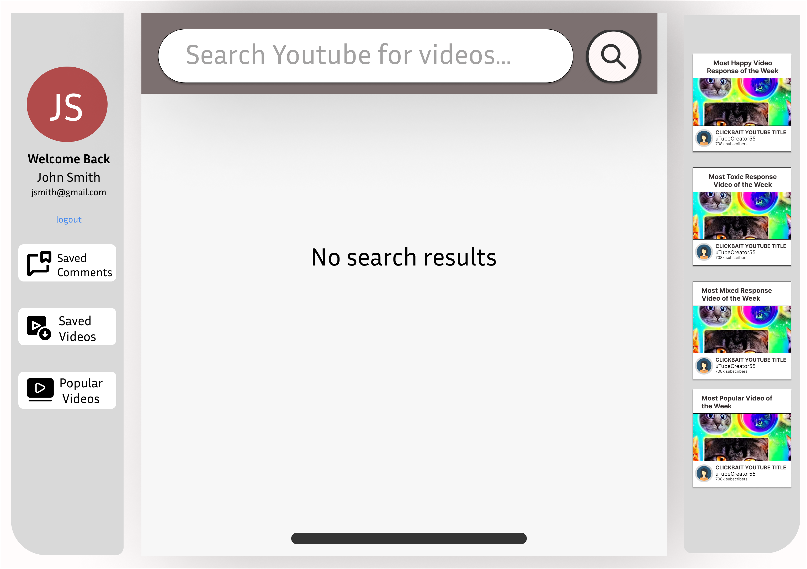
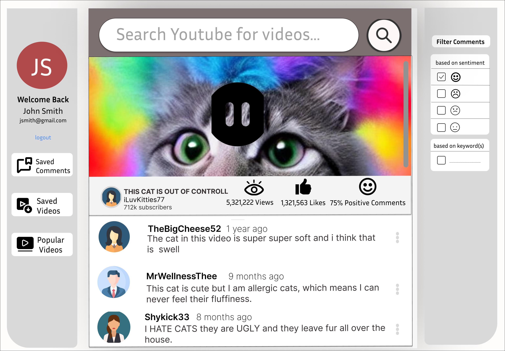

---
## 1.	Introduction 
### 1.1 Purpose
The purpose of this document is to describe the implementation details and objectives of our Youtube Comment Sentiment Analysis application
### 1.2 Intended Audience*
This document is intended primarily for our developers and the instructor of the Software Engineering 4351 course. 

### 1.3 Intended Use -- Sam

### 1.4 Scope  -- Sam

### 1.5 Definitions and Acronyms

This document will use the following naming conventions:
o	YCSA - Youtube Comment Sentiment Analysis. The application being discussed in this document
o	NLTK - Natural Language Toolkit (https://www.nltk.org/), Library being used for the base textual sentiment analysis.

The following words are defined as such:
o	‘User’ refers to a person that accesses the YCSA application or the general Youtube website.
o	‘Comment’ refers to a text post attached to a Youtube video made by Users.
---
## 2.	Overall Description

### 2.1 User Needs

YCSA is an attempt to address two things at once:
1)	Users of the Youtube site often encounter comments that are overly negative or even offensive and there is no built-in way to screen for these comments. 
2)	Metrics such as view count and subscriptions are not necessarily indicative of the overall opinion of a video. Additionally, the removal of the ‘dislike’ count by google leaves Users with only likes to gauge how a video is received. This does not allow for negative views on a video to be considered in their selection. 
The YCSA has the potential to give Users the ability to screen out negative comments and additionally the same functionality can be used to scan comment feeds and give an opinion-based score to a video. This will improve the user experience of Youtube without interfering with the already existing interface. 

### 2.2 Assumptions and Dependencies
	The following assumptions are made:
1)	A sustainable number of Users both read video comments and are interested in filtering based on comment sentiment.
2)	Comment sentiment analysis is an effective metric to qualify the quality of a video in the first place. 
3)	Youtube will continue to allow comment scraping and video embedding for their videos in the future

	Major dependencies:
1)	This app relies on third party libraries and APIs such as Google’s Youtube API 
2)	NLTK is used for textual analysis.
Currently these APIs are offered free of charge for use but availability and development activity could change at any time. 
---
## 3. 	System Features and Requirements

### 3.1 Functional Requirements – hafsa $ Rob

#### 3.1.1 Functional Requirement 1: Login and Signup

Description: A user should be able to sign up or log in through their Google account and they would be taken to the homepage. Acceptance criteria:
1.	When a first-time user opens YCSA, they will be taken to a page asking them to either sign up or log in through their google account.
2.	The first-time user will click on the sign-up button, and they will enter their google account.
3.	When the user signs up for the first time they will be sent a confirmation email to their google account.
4.	If the user is not a first-time user, they will click on the log in button and will be directed to YCSA.
5.	The user only needs to log in once and they will remain authenticated unless the user logs out.

#### 3.1.2 Functional Requirement 2: Search

Description: User should be able to search up any video they want by entering a keyword or a phrase into the search bar. After entering a keyword(s) the user will get a display of videos based on the search parameters. Acceptance criteria:
1.	The first thing the user sees when they log in is the homepage. On the top of the homepage, they will find the search bar.
2.	When they click on the search bar, they can search any keyword.
3.	After inputting the keyword, the user will click on the search icon that is near the search bar.
4.	Once it is clicked, it will display all of the videos related to the keyword the user searched.

#### 3.1.3 Functional Requirement 3: Saved comments

Description: The user can look through the comments that they saved in their previous log ins. In addition to saving comments, users can also unsave them. Acceptance criteria:
1.	In the homepage you will also find the saved comments button that is on the left side of the page.
2.	When the user clicks on this button, the user will get a display of all the comments that are saved in the previous log ins.
3.	The user can also unsave their previous comments on this page.
4.	By hovering over the comment, the more icon will appear.
5.	In the more icon one of the options that will appear is “unsave” and by clicking on it, the comment will be unsaved.

#### 3.1.4 Functional Requirement 4: filter comments

Description: The user can filter comments that they do not like by using the sentiment box or by writing the keywords on the text box. The user will be able to delete the comments that they do not like to see on their page. Acceptance criteria:
1.	A user will be taken to the next page once they click on one of the videos displayed after searching by keywords.
2.	In this page the user will face a text that says “filter comments” on the top/right side of the page.
3.	Under the text there will be a sentiment box that will have 4 emojis that are based on the sentiment of the comments. 
	(I.e., “sad emoji”this means that the user can remove any negative words like; ugly etc.)
4.	By checking the check box near the emojis the user will filter the comments based on this emoji.
5.	The user can also filter the comments by use of the keyword filter.
6.	In the center/right side of the page the user will find a keyword filter box with the text “based on keyword(s)”.
7.	The user can write down any phrase or keyword they do not want to appear in their comments.
8.	The user will see keywords or phrases that they wrote down in the comments after the page reloads.

#### 3.1.5 Functional Requirement 5: Saved videos

Description: A User can access the saved videos that they saved from their previous log ins. The user can also unsave the videos. Acceptance criteria:
1.	In the homepage, the page will have a saved videos button on the bottom/left side.
2.	By clicking on the button, you will get a display of all the video you saved in your you tube account.
3.	When looking through the saved videos the user can scroll down the video and click on the more icon.
4.	In the more icon you will find an option “unsave” and by clicking on it the video will be unsaved.
5.	When the page reloads the video will be unsaved.

#### 3.1.6 Functional Requirement 6: View Recommended Videos- rob

Description: User will be able to view a list of videos recommended by the YouTube algorithm for their account (based on previous search history, demographics etc.)
1.	User, if logged in, will be able to select the “Recommended Videos” page
2.	Upon loading, this page will display a grid of videos recommended to them by the YouTube algorithm
3.	From here the user will be able to select a video to watch in addition to viewing sentiment analysis information based on the comments in 	each video (like any video list on the app)
4.	The User will be directed to the player view upon selecting any given video.

#### 3.1.7 Functional Requirement 7: View User Subscriptions Page- rob

Description: User will be able to view a list of videos released by accounts they have subscribed to previously
1.	User, if logged in, will be able to select the “Subscriptions” page
2.	Upon loading, this page will display a grid of videos recently released by accounts they subscribe to
3.	If the User is not subscribed to any accounts a message will display notifying them that there are no videos to pull and that they can subscribe to channels to use this feature.
4.	The list of videos will by default be sorted by date and will display videos grouped by age of release vertically (e.g. “Released Today”, “last week” etc.) with the newest videos being displayed on top
5.	From here the user will be able to select a video to watch in addition to viewing sentiment analysis information based on the comments in each video (like any video list on the app)
6.	The User will be directed to the player view upon selecting any given video

#### 3.1.8 Functional Requirement 8: Manage Personal Channel Uploads- rob

Description: User can view and upload videos to their own personal YouTube channel from within the YCSA interface
1.	From any page the User can click on their account icon, if logged in, to navigate to the Channel page
2.	User will select Create button and then select Upload Video
3.	User will be prompted to select a file which can be passed to the main YouTube client.
4.	Basic editing functions will be available after which the user can Submit their video to the official site.

### 3.2 External Interface Requirements
#### After logging in User will be at an empty home page with no displayed search results

#### User enters keywords into the seach bar and selects the search button which will refresh the page to display results in a grid. 

#### User clicks on a video to view which will take them to the viewing page where they can watch content and browse content

### 3.3 System Requirements*
For a user, any computer with specifications sufficient for web browsing will be adequate. 
A server hosting the application backend must have enough power to process NLTK sentiment analysis. Research on the exact requirements is ongoing. 

### 3.4 Nonfunctional Requirements – Jaz

